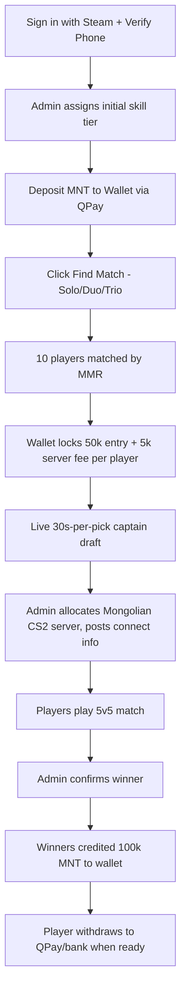

# CS2 Paid Matchmaking Platform - PRD (MVP v1.0)

## 1. Summary

A web platform that lets Mongolian CS2 players sign in with Steam, deposit MNT into a wallet, queue for 5v5 paid competitive matches, get drafted by captains, play on Mongolia-hosted custom CS2 servers, and receive payouts automatically into their wallet. Replaces the current manual Discord + admin transfer workflow.

- Target launch: 2-3 months
- Geography: Mongolia only, MNT currency
- Initial scale: 5-8 matches/day growing to 20+/day
- Automation in MVP: payments, queue, draft, server allocation (manual contracting), wallet, payout trigger
- Still admin-assisted in MVP: match result confirmation, server contracting, dispute review

## 2. Goals and Non-Goals

### Goals

- Eliminate manual money transfers between players and admins
- Cut admin workload per match by >70% vs. current Discord flow
- Preserve the captain-draft ritual and duo/trio draft-advantage rule the community already loves
- Make skill rating transparent and self-correcting via hybrid Admin-tier + ELO
- Build the data foundation (matches, results, ratings, wallet, behavior score) needed to automate result verification and payouts in v2

### Non-Goals (MVP)

- Multi-country / multi-currency support
- Tournaments / leagues / brackets (only ladder matches)
- Native mobile apps
- Fully automated result detection (admin-confirmed in v1, automated in v2)
- Spectator betting on matches
- In-platform voice chat (players keep using Discord voice)

## 3. Critical Open Risks (must be resolved before/during build)

These three items materially affect product viability and must be tracked as blocking issues, not assumptions.

- **R1 - Legal positioning**: Paid skill-based CS2 matches with real-cash payouts may be classified as gambling under Mongolian law. The MVP assumes "skill-based gaming with entry fee + prize pool, light KYC" but this must be reviewed by a Mongolian lawyer before public launch. If reclassified as gambling, KYC, age-gate, licensing, and tax-withholding requirements all increase substantially.
- **R2 - Mongolia-hosted CS2 server supply**: 0 ping is a hard requirement. Today no provider/strategy has been chosen. MVP will manually contract with current Mongolian server operators; v2 will automate via provider API. This is a single point of failure that must be solved before MVP launch.
- **R3 - Automated result verification**: MVP relies on admin confirming the winner. As volume grows past ~20 matches/day this becomes the bottleneck. v2 must add automated detection (CS2 GSI or RCON via Get5/MatchZy plugin) - flagged as the highest-priority post-MVP work.

## 4. Personas

- **Solo Player (Бат)**: Lower-group player, queues alone at night, wants quick matches and fair teams
- **Stack Player (Ану + 2 нөхөр)**: Upper-group player, queues as duo/trio with friends, expects opposing team gets draft compensation
- **Captain**: Top-rated player drafted as captain, picks teammates under a timer
- **Match Admin**: Confirms winner, handles in-match disputes, sub-ins players
- **Finance Admin**: Approves manual deposits (edge cases), triggers payouts, reviews refund tickets
- **Super Admin**: Manages roles, server contracts, system config

## 5. User Flow Overview

## 6. Functional Requirements

### 6.1 Authentication and Identity

- Sign in with Steam (OpenID 2.0). Steam account is the primary identity.
- Phone number verification via SMS OTP, required before first match.
- **One verified phone = one account** (anti-smurf).
- Steam account must:
  - Have no active VAC or game ban on CS2
  - Be at least N days old (default 90, configurable by Super Admin)
  - Have at least X hours played in CS2 (default 100, configurable)
- Optional Discord OAuth link to enable role sync and queue notifications via Discord bot.
- Account states: `pending_phone`, `active`, `restricted` (behavior score too low), `banned`.

### 6.2 Wallet and Payments

- Each user has a single MNT wallet (signed integer cents to avoid float).
- Wallet operations: `deposit`, `withdraw`, `escrow_hold`, `escrow_release`, `escrow_capture`, `payout_credit`, `refund`, `admin_adjustment` - each is an immutable ledger entry.
- Deposits via QPay (primary). Recommend adding SocialPay + Khan Bank API + manual bank transfer (admin-confirmed) as fallbacks - flag for stakeholder confirmation.
- Withdrawals: player initiates, instant if same payment provider used to deposit, manual review for cross-channel or >threshold amounts.
- Per-match flow:
  1. On queue join, verify `wallet.available_balance >= 55,000 MNT`
  2. On match found (10 players matched), atomically `escrow_hold(55,000)` for each player
  3. If any player's hold fails, the queue retries that slot; affected player gets a "balance dropped" notification
  4. On admin-confirmed result: `escrow_capture(55,000)` for all 10, then `payout_credit(100,000)` to each of the 5 winners
- Limits (configurable, sensible defaults):
  - Min deposit: 10,000 MNT
  - Max deposit per day: 2,000,000 MNT (KYC tier 1)
  - Max withdrawal per day: 1,000,000 MNT (KYC tier 1)
- Server fee accounting: 5,000 MNT/player x 10 = 50,000 MNT/match goes to a dedicated `server_cost` ledger account, used to reconcile against the monthly server contract.

### 6.3 Matchmaking Queue

- **Continuous matchmaking** model. Player clicks Find Match, picks Solo/Duo/Trio, queue holds them until 10 are matched.
- Matching algorithm groups by MMR within an expanding tolerance window (start +/- 100, widens every 30s).
- Party support:
  - Solo, Duo (party of 2), Trio (party of 3) allowed. Quads and 5-stacks blocked in MVP.
  - If a duo or trio is matched, the side without the party gets **draft-pick advantage** (first 3 picks before alternating) - mirrors current Discord rule.
- Each player can only be in one queue at a time.
- Queue cancellation: free if not yet matched, costs nothing; after match is found there is a 60s accept window - failing to accept = behavior score penalty.

### 6.4 Captain Draft

- The two highest-MMR players among the 10 are captains.
- Live in-browser draft using WebSockets:
  - 30s timer per pick, auto-pick (highest-MMR remaining) if timer expires
  - Both captains and 8 other players see the draft board in real time
  - Captain A picks first, then alternating, except if duo/trio is on one side - other side gets first 3 picks then alternates
- After draft, lobby screen shows teams, connect-info appears once admin allocates a server.

### 6.5 Server Allocation and Match Lifecycle (MVP: manual)

- MVP: admin sees a list of "matches ready for server" and assigns one of the contracted Mongolian CS2 servers; pastes connect info (`ip:port` and password) into the match.
- Match state machine: `queueing` -> `drafting` -> `awaiting_server` -> `live` -> `awaiting_result` -> `completed` | `cancelled` | `disputed`.
- Each match has: roster (10 players + 2 captains), team assignments, server info, start time, expected duration (~60 min), and a unique `match_id`.
- v2: integrate with Mongolian server provider API to spin up servers + apply config + push roster automatically.

### 6.6 Result Confirmation and Payout (MVP: admin-assisted)

- After match end, both captains submit final score in the platform.
- If scores agree -> admin reviews + clicks Confirm -> automatic payout.
- If scores disagree or anyone files a dispute -> moves to `disputed` state, admin reviews evidence (GOTV demo link, screenshots) and decides.
- Auto-confirm safety: admin must confirm within 24h or the match is auto-escalated to Super Admin.
- **v2 (post-MVP, flagged as highest priority follow-up)**: automated result detection via:
  - Option A - CS2 GSI: server pushes match events directly to platform endpoint
  - Option B - RCON polling with Get5 or MatchZy plugin reporting final score on `cs2_server_event`
  - Either eliminates the captain-confirms step and the admin click

### 6.7 Skill Rating (Hybrid: Admin Tier + ELO)

- On signup, an admin assigns an **initial tier** from the existing community taxonomy: `Pro`, `Semi-Pro`, `1-1`, `1-2`, `1-3`, `2-1`, `2-2`, `2-3`, `3-1`, `3-2`, `3-3`. Each tier maps to a starting MMR (e.g. Pro=2200, Semi-Pro=2000, 1-1=1800, ..., 3-3=1000).
- After each match, MMR updates via a standard 5v5 team-ELO formula with K-factor 32 (configurable) and a multiplier based on score-differential (e.g. 16-3 swing > 16-14 swing).
- Tier is auto-recomputed from MMR every match (with a 50-MMR hysteresis to prevent tier flapping).
- Players can dispute their tier via a ticket; Skill Admin can override the MMR (logged in audit trail).
- Internal MMR is hidden from players for MVP (only tier is shown). Public reveal is a v2 decision.

### 6.8 Anti-Cheat and Fairness

Mandatory in MVP:

- VAC and game-ban check at signup and re-checked weekly via Steam API
- Minimum Steam account age and CS2 hours (see 6.1)
- One verified phone = one account
- Auto-record GOTV demo for every match, stored 30 days
- Internal **trust factor / behavior score** (0-100, starts at 80) - drops on: leavers, reports confirmed, late accepts, admin warnings. Restrictions kick in at <50 (longer queue times, higher MMR opponents), bans at <20.

Recommended additional anti-cheat (flagged for MVP-or-soon-after decision):

- Re-check VAC/game-ban immediately before each match start, not just weekly
- IP + device fingerprint heuristics for smurf-account detection (alt account joined from same fingerprint as a banned account triggers admin review)
- Sudden MMR-jump anomaly detector (silver-tier player suddenly winning every round = flagged for demo review)
- Manual demo review queue: players can submit a timestamped report on a finished match; Skill/Match Admin reviews
- Shadow-ban: banned account can queue but never matches, prevents informing the cheater
- Stream-delay on GOTV (90s) to prevent stream-sniping
- Phase 2: optional 3rd-party AC integration (FACEIT-AC client, ESL Wire, or in-house kernel-level AC) - heavyweight, defer
- Phase 2: mandatory anti-cheat client download before queueing (community pushback risk)

### 6.9 Disputes, Refunds, and Behavior Score

Default policy (automated strict):

- **No-show** (failed to connect within 10 min of server-ready): player loses entry fee, team plays 4v5 or forfeits at captain's choice, behavior score -10
- **Mid-match rage-quit** (left without returning for 3 consecutive rounds): treated as forfeit by their team, behavior score -15
- **Server crash before round 6**: full refund to all 10, no MMR change
- **Server crash after round 6**: leading team gets winner payout; if tied, full refund
- **Confirmed cheater (post-match)**: cheater's team's winnings clawed back to the other team, cheater account banned, behavior score reset
- **No refunds** outside the above cases except via Finance Admin override (audited)

Dispute ticket UI: any player can open a ticket on a finished match with text + demo link; routed to Match Admin queue.

### 6.10 Admin Panel (Tiered)

Three tiers with role-based access:

- **Super Admin**: manage admin roles, server contracts, system config (thresholds, K-factor, fee amounts), view all ledger entries, manual wallet adjustments
- **Finance Admin**: review/approve manual deposits, trigger payouts (in MVP these are triggered automatically by match confirm; this role handles edge cases), process refund tickets, view wallet ledger
- **Match Admin**: allocate CS2 servers to matches, confirm winner, cancel matches, sub players, handle in-match disputes
- **Skill Admin**: set initial tier, override MMR, review tier-dispute tickets, ban smurfs
- **Support**: read-only access + ability to respond to user tickets

All admin actions write to an immutable `admin_audit_log`.

### 6.11 Community Migration and Discord Integration

- Discord bot: posts queue status, match-found pings, match-result summaries, leaderboard changes
- Existing Discord admins are pre-onboarded as platform admins
- Bulk-import of current community players' Steam IDs + their existing skill tiers via a CSV upload (Super Admin only) - one-time migration on launch
- Public leaderboard page (web) with rank, tier, W/L, K/D, recent matches

### 6.12 Notifications

- In-app: match found, draft turn, server ready, payout received, ticket reply
- Email: payout received, withdrawal status, account-restriction warnings
- Discord DM (if linked): match-found alert (most important for community continuity)

## 7. Non-Functional Requirements

- Match-found to draft: under 5 seconds end-to-end
- Captain draft UI latency: under 500ms per pick action (WebSocket)
- Wallet ledger consistency: ACID, double-entry style, no negative balances allowed
- Server uptime target: 99.5% for the platform; ping to Mongolian CS2 servers <10ms for players in Mongolia (driven by infra choice)
- Idempotent payment webhooks (QPay callback can be retried without double-credit)
- All money operations logged with `(user_id, match_id, amount, op, ts, request_id)` and reconcilable end-of-day

## 8. Technical Assumptions

Recommendation (skipped by stakeholder, proposing default):

- Frontend: Next.js (App Router) + React + Tailwind, deployed to Vercel or Mongolian hosting
- Backend: Next.js API routes for thin endpoints + a separate Node service (NestJS or Fastify) for the matchmaking + draft WebSocket workloads
- DB: Postgres (Supabase or managed) for relational data + ledger; Redis for queue state and pub/sub on draft events
- Auth: Steam OpenID for primary login, Discord OAuth for optional link, SMS OTP for phone verification (Mongolian SMS provider TBD - flag)
- Realtime: WebSockets for queue + draft, fall back to Server-Sent Events
- Payments: QPay webhook integration; payment provider abstraction so additional Mongolian providers can be added
- Server allocation in MVP: admin panel UI only; v2 adds provider-specific adapters behind a common interface
- Anti-cheat data: Steam Web API client cached in Redis with weekly refresh

## 9. MVP Scope (In vs Out)

In MVP:

- Steam + phone signup, VAC/game-ban + account-age checks
- Wallet model with QPay deposits, escrow per match, automatic credit on result confirm
- Continuous matchmaking queue with solo/duo/trio + draft-advantage rule
- Live captain draft with 30s timer
- Manual server allocation by Match Admin
- Hybrid skill rating (admin initial + auto ELO + tier mapping)
- Admin panel with tiered roles
- Captain-submitted scores + admin-confirmed result -> automatic payout
- Automated strict dispute/refund policy + behavior score
- Discord bot for notifications + bulk community migration via CSV import
- Public leaderboard + basic profile pages

Explicitly Out of MVP (deferred):

- Automated match result detection (R3 - top priority post-MVP)
- Automated server provisioning via provider API
- Native mobile apps
- Tournaments / brackets / leagues
- Seasons + seasonal rewards
- 3rd-party anti-cheat client integration
- Public MMR display
- Multi-currency / multi-country

## 10. Post-MVP Roadmap (priority order)

1. Automated result verification via CS2 GSI or Get5/MatchZy RCON (kills the admin bottleneck)
2. Automated server provisioning behind a provider-adapter interface
3. Native PWA / mobile + push notifications
4. Seasons with periodic MMR soft-reset + cosmetic rewards
5. Optional 3rd-party anti-cheat client requirement
6. Tournament mode (single/double elim brackets)

## 11. Success Metrics

- Activation: phone-verified accounts / Steam signups - target 60%
- Liquidity: avg matches/day - target 15 by month 2 (vs. 5-8 today)
- Admin load: admin-minutes per match - target under 3 min (vs. ~15 today)
- Wallet retention: % of payouts that stay in wallet (re-played) vs. withdrawn - higher is better
- Behavior: % of matches with no leavers - target >85%
- Disputes: % of matches escalated to admin - target <5%

## 12. Items to Resolve Before/During Build

These remain open and must be tracked:

- **R1 Legal review** - Mongolian lawyer to confirm skill-based-gaming classification, KYC level required, age-gate, tax/VAT obligations
- **R2 Mongolian CS2 server supply** - identify 2-3 contracted server operators, pricing, capacity, SLA, RCON access for future automation
- **R3 Result verification automation path** - decide GSI vs Get5/MatchZy vs RCON polling; influences server-side plugin requirements
- Mongolian SMS OTP provider selection
- Confirm additional payment providers beyond QPay (SocialPay, Khan Bank, manual bank, crypto?)
- Concrete K-factor + initial-MMR-per-tier table to be tuned with community input
- Anti-cheat additions to enable in MVP vs. defer (the recommended list in 6.8)
- Withdrawal fee policy (platform takes a cut? matches the 5k server fee? need stakeholder input)
- Branding / product name / domain
- Privacy policy + Terms of Service drafted in Mongolian and English
