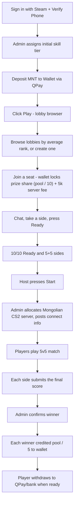

# Bulaa paid 5v5 lobbies PRD (MVP v1.0)

## 1. Summary

A web platform that lets Mongolian CS2 players sign in with Steam, deposit MNT into a wallet, open Play to browse player-made lobbies, join one of 10 seats, ready up, play on Mongolia-hosted custom CS2 servers, and receive payouts automatically into their wallet. Replaces the current manual Discord + admin transfer workflow.

- Target launch: 2-3 months
- Geography: Mongolia only, MNT currency
- Initial scale: 5-8 matches/day growing to 20+/day
- Automation in MVP: payments, lobbies, ready and start, server allocation (manual contracting), wallet, payout trigger
- Still admin-assisted in MVP: match result confirmation, server contracting, dispute review

Players run the lobbies. The platform holds the money, shows each lobby's average rank, gives members a chat to sort out teams, and lets members vote out anyone who blocks the start.

## 2. Goals and Non-Goals

### Goals

- Eliminate manual money transfers between players and admins
- Cut admin workload per match by >70% vs. current Discord flow
- Let players run their own lobbies instead of waiting on a system to group them
- Show each lobby's average rank so a player can judge the match before joining
- Give every lobby a chat so members can balance teams themselves
- Let members vote out a player who sits not-Ready and blocks the start
- Make skill rating transparent and self-correcting via hybrid Admin-tier + ELO
- Build the data foundation (matches, results, ratings, wallet, behavior score) needed to automate result verification and payouts in v2

### Non-Goals (MVP)

- Multi-country / multi-currency support
- Tournaments / leagues / brackets (only ladder matches)
- Native mobile apps
- Fully automated result detection (admin-confirmed in v1, automated in v2)
- Spectator betting on matches
- In-platform voice chat (players keep using Discord voice)

## 3. Critical Open Risks (must be resolved before/during build)

These three items materially affect product viability and must be tracked as blocking issues, not assumptions.

- **R1 Legal positioning.** Paid skill-based CS2 matches with real-cash payouts may be classified as gambling under Mongolian law. The MVP assumes "skill-based gaming with entry fee + prize pool, light KYC" but this must be reviewed by a Mongolian lawyer before public launch. If reclassified as gambling, KYC, age-gate, licensing, and tax-withholding requirements all increase substantially.
- **R2 Mongolia-hosted CS2 server supply.** 0 ping is a hard requirement. Today no provider or strategy has been chosen. MVP will manually contract with current Mongolian server operators. v2 will automate via provider API. This is a single point of failure that must be solved before MVP launch.
- **R3 Automated result verification.** MVP relies on admin confirming the winner. As volume grows past ~20 matches/day this becomes the bottleneck. v2 must add automated detection, either CS2 GSI or RCON via the Get5 or MatchZy plugin. Flagged as the highest-priority post-MVP work.

## 4. Personas

- **Solo Player (Бат)**: Lower-group player, plays at night, scans the lobby list by average rank and joins one that looks fair
- **Stack Player (Ану + 2 нөхөр)**: Upper-group player, creates a lobby or joins one with friends, sorts out sides in lobby chat
- **Host**: The player who created the lobby. Assigns Team A and Team B, and presses Start once all 10 seats are Ready. Not a skill role
- **Match Admin**: Confirms winner, handles in-match disputes, subs in players, closes abusive lobbies
- **Finance Admin**: Approves manual deposits (edge cases), triggers payouts, reviews refund tickets
- **Super Admin**: Manages roles, server contracts, system config

## 5. User Flow Overview

## 6. Functional Requirements

### 6.1 Authentication and Identity

- Sign in with Steam (OpenID 2.0). Steam account is the primary identity.
- Phone number verification via SMS OTP, required before first match.
- **One verified phone = one account** (anti-smurf).
- Steam account must:
  - Have no active VAC or game ban on CS2
  - Be at least N days old (default 90, configurable by Super Admin)
  - Have at least X hours played in CS2 (default 100, configurable)
- Optional Discord OAuth link to enable role sync and lobby notifications via Discord bot.
- Account states: `pending_phone`, `active`, `restricted` (behavior score too low), `banned`.

### 6.2 Wallet and Payments

- Each user has a single MNT wallet (signed integer cents to avoid float).
- Wallet operations: `deposit`, `withdraw`, `escrow_hold`, `escrow_release`, `escrow_capture`, `payout_credit`, `refund`, `admin_adjustment`. Each one is an immutable ledger entry.
- Deposits via QPay (primary). Recommend adding SocialPay + Khan Bank API + manual bank transfer (admin-confirmed) as fallbacks. Flag for stakeholder confirmation.
- Withdrawals: player initiates, instant if same payment provider used to deposit, manual review for cross-channel or >threshold amounts.
- Lobby pricing. The host picks the prize pool `P` when creating the lobby (6.3):
  - `P` is the whole-match prize: 30,000 to 500,000 MNT, a multiple of 10. The client and server both validate it
  - Prize share per player: `P / 10`
  - Server fee per player: 5,000 MNT, a platform setting (`SERVER_FEE_MNT`). Players cannot change it
  - Cost to create or join: `P / 10 + server fee`. The example below uses the default `P` = 30,000 MNT, which costs 8,000 MNT
  - Payout to each of the 5 winners: `P / 5`
  - `P` and the server fee are both fixed on the lobby at creation. A later fee change never reprices an open lobby
- Per-match flow, where `cost` is the lobby's create/join cost:
  1. Before a player creates or joins a lobby, verify `wallet.available_balance >= cost`
  2. On a successful join, `escrow_hold(cost)` for that player
  3. If the hold fails, deny the join and tell the player their balance dropped
  4. When a player leaves, or a vote kick removes them, `escrow_release(cost)`
  5. On Start, all 10 holds stay in place until the result is settled
  6. On admin-confirmed result: `escrow_capture(cost)` for all 10, then `payout_credit(P / 5)` to each of the 5 winners
- Limits (configurable, sensible defaults):
  - Min deposit: 10,000 MNT
  - Max deposit per day: 2,000,000 MNT (KYC tier 1)
  - Max withdrawal per day: 1,000,000 MNT (KYC tier 1)
- Server fee accounting: the lobby's server fee x 10 (50,000 MNT/match at the 5,000 default) goes to a dedicated `server_cost` ledger account, used to reconcile against the monthly server contract.

### 6.3 Lobby browser, create, and join

- Play opens a list of open lobbies. Players create the lobbies. The platform does not group players.
- Lobbies have no name. Each lobby card shows:
  - Host name and host tier
  - Prize pool
  - Occupancy as `n/10`
  - Ready count as `n/10`
  - Average displayed tier, the mean of the tiers of everyone in the lobby
  - Lobby age since creation
- The lobby detail shows the joiner's cost: prize share + server fee = total, and the wallet balance after joining.
- Average rank is information for the joiner. It is not a hard join gate.
- Optional soft warning: if the joiner's tier sits far from the lobby average, the join dialog says so. The gap that triggers the warning is configurable and it never blocks the join.
- The list updates live. A new lobby, a seat change, and a closed lobby all appear without a page reload.
- Create a lobby: any `active` player whose wallet covers the cost. Create opens a modal wizard with two steps:
  1. Prize pool: the host enters an amount or picks a preset, and sees their share, the server fee, and the winner payout
  2. Confirm: prize pool, winner payout, your share, the server fee (read-only), the total cost, and the wallet balance before and after
- The creator becomes the host and takes seat 1.
- Join a lobby: same balance and account-state check. Join is blocked once 10 seats are taken.
- A player can be in one lobby at a time. Creating or joining a second one is blocked until they leave the first.
- Leaving is free while the lobby is `open`. The seat reopens and escrow is released.
- If the host leaves, the member who joined earliest becomes host. If the last member leaves, the lobby closes.

### 6.4 Lobby room, sides, Ready, and Start

- The lobby room shows all 10 seats, each with the player name and displayed tier, the current sides, and who is Ready.
- Players sort out teams themselves. Chat is the coordination tool (6.5).
- The host can assign each member to Team A or Team B. Sides are valid at 5 and 5.
- Each player in the lobby toggles Ready. A player can go back to not-Ready at any time before Start.
- Host Start is enabled only when all three hold:
  1. 10 seats are taken
  2. All 10 players are Ready
  3. Sides are 5 and 5
- The host is the only player who can press Start. Auto-start is out of MVP.
- If the lobby has been at 10/10 Ready for longer than the idle limit (default 3 minutes, configurable) and the host has not pressed Start, the host seat transfers to the member who joined earliest. Members can also vote the host out (6.6).
- On Start the lobby moves to `starting`, then to `awaiting_server` (6.7). Seats, sides, and Ready flags are frozen from `starting` onward.

### 6.5 Lobby chat

- Every lobby has one text chat. Only lobby members can read and post.
- Chat exists for the coordination work: calling sides, swapping players to balance tiers, agreeing on a map, waiting on a friend.
- Rate limit per player (configurable defaults): 5 messages per 10 seconds, 300 characters per message.
- No in-platform voice in MVP. Players keep using Discord voice.
- Messages persist while the lobby is `open`. When the lobby closes, the messages are deleted. When the match goes live, the chat freezes and the transcript moves to the match log for dispute review.

### 6.6 Vote kick

Some players take a seat and never press Ready, which blocks the other 9. Vote kick is the members' own fix.

- Any lobby member can start a vote against one other member.
- A vote needs at least 3 members in the lobby. Below that, vote kick is unavailable.
- Threshold: a majority of current members excluding the target, `ceil((n-1)/2)+1` yes votes.
- The vote window is 30 seconds. A vote that misses the threshold in the window fails.
- One active vote at a time per lobby. Cooldown of 2 minutes per target after a failed or successful vote.
- On success: the target loses their seat, `escrow_release(cost)` runs, and the seat reopens.
- If the target sat not-Ready for more than 2 minutes before the vote passed, their behavior score takes a small hit (6.11).
- If the target was the host, the host seat transfers to the remaining member who joined earliest.
- A kicked player can join another lobby right away.
- Vote kick is only available while the lobby is `open`. After Start, a missing player is a no-show and a Match Admin handles it.

### 6.7 Server Allocation and Match Lifecycle (MVP: manual)

- MVP: admin sees a list of matches waiting for a server and assigns one of the contracted Mongolian CS2 servers, then pastes connect info (`ip:port` and password) into the match.
- Lobby and match state machine: `open` -> `starting` -> `awaiting_server` -> `live` -> `awaiting_result` -> `completed` | `cancelled` | `disputed`.
- Ready is a flag on each lobby member while the lobby is `open`. It is not a state of the lobby.
- Each match has: roster of 10 players, team assignments, host, server info, start time, expected duration (~60 min), and a unique `match_id`.
- v2: integrate with Mongolian server provider API to spin up servers, apply config, and push the roster automatically.

### 6.8 Result Confirmation and Payout (MVP: admin-assisted)

- After the match ends, each side submits the final score in the platform. Any player on that side can submit it, and the first submission per side counts.
- If the two scores agree, an admin reviews and clicks Confirm, then payout runs automatically.
- If the scores disagree, or anyone files a dispute, the match moves to `disputed`. An admin reviews the evidence (GOTV demo link, screenshots, lobby chat transcript) and decides.
- Auto-confirm safety: an admin must confirm within 24h or the match is auto-escalated to Super Admin.
- **v2 (post-MVP, flagged as highest priority follow-up)**: automated result detection via:
  - Option A, CS2 GSI. The server pushes match events directly to a platform endpoint
  - Option B, RCON polling with the Get5 or MatchZy plugin reporting the final score on `cs2_server_event`
  - Either one removes the player-submits step and the admin click

### 6.9 Skill Rating (Hybrid: Admin Tier + ELO)

- On signup, an admin assigns an **initial tier** from the existing community taxonomy: `Pro`, `Semi-Pro`, `1-1`, `1-2`, `1-3`, `2-1`, `2-2`, `2-3`, `3-1`, `3-2`, `3-3`. Each tier maps to a starting MMR (e.g. Pro=2200, Semi-Pro=2000, 1-1=1800, ..., 3-3=1000).
- After each match, MMR updates via a standard 5v5 team-ELO formula with K-factor 32 (configurable) and a multiplier based on score-differential (e.g. 16-3 swing > 16-14 swing).
- Tier is auto-recomputed from MMR every match (with a 50-MMR hysteresis to prevent tier flapping).
- Players can dispute their tier via a ticket. A Skill Admin can override the MMR (logged in audit trail).
- Internal MMR is hidden from players for MVP. Only the tier is shown, and the lobby browser averages those displayed tiers. Public MMR reveal is a v2 decision.

### 6.10 Anti-Cheat and Fairness

Mandatory in MVP:

- VAC and game-ban check at signup and re-checked weekly via Steam API
- Minimum Steam account age and CS2 hours (see 6.1)
- One verified phone = one account
- Auto-record GOTV demo for every match, stored 30 days
- Internal **trust factor / behavior score** (0-100, starts at 80). It drops on leavers, confirmed reports, sitting not-Ready until vote-kicked, no-shows after Start, and admin warnings.
- Restrictions at a score below 50, kept deliberately simple: the Create button is hidden, and joins are limited to lobbies whose average tier is close to the player's own tier. Bans at a score below 20.

Recommended additional anti-cheat (flagged for MVP-or-soon-after decision):

- Re-check VAC/game-ban immediately before each match start, not just weekly
- IP + device fingerprint heuristics for smurf-account detection (an alt account joined from the same fingerprint as a banned account triggers admin review)
- Sudden MMR-jump anomaly detector (a silver-tier player suddenly winning every round gets flagged for demo review)
- Manual demo review list: players can submit a timestamped report on a finished match, and a Skill or Match Admin reviews it
- Shadow-ban: a `banned` account can open Play and see the lobby list, but every join is rejected. The account never reaches a match and is never told it is banned.
- Stream-delay on GOTV (90s) to prevent stream-sniping
- Phase 2: optional 3rd-party AC integration (FACEIT-AC client, ESL Wire, or in-house kernel-level AC). Heavyweight, defer.
- Phase 2: mandatory anti-cheat client download before joining a lobby (community pushback risk)

### 6.11 Disputes, Refunds, and Behavior Score

Default policy (automated strict):

- **Sat not-Ready and got vote-kicked** (not-Ready for more than 2 minutes before the vote passed): escrow released in full, behavior score -5
- **No-show after Start** (failed to connect within 10 min of server-ready): player loses entry fee, their side plays 4v5 or forfeits at the choice of the remaining four, behavior score -10
- **Mid-match rage-quit** (left without returning for 3 consecutive rounds): treated as a forfeit by their side, behavior score -15
- **Server crash before round 6**: full refund to all 10, no MMR change
- **Server crash after round 6**: leading side gets winner payout. If tied, full refund.
- **Confirmed cheater (post-match)**: the cheater's side's winnings are clawed back to the other side, the cheater account is banned, behavior score reset
- **No refunds** outside the above cases except via Finance Admin override (audited)

Dispute ticket UI: any player can open a ticket on a finished match with text + demo link. Tickets are routed to the Match Admin ticket list.

### 6.12 Admin Panel (Tiered)

Roles with role-based access:

- **Super Admin**: manage admin roles, server contracts, system config (thresholds, K-factor, fee amounts, lobby idle limit, vote-kick settings), view all ledger entries, manual wallet adjustments
- **Finance Admin**: review/approve manual deposits, trigger payouts (in MVP the match confirm triggers these automatically, so this role handles edge cases), process refund tickets, view wallet ledger
- **Match Admin**: allocate CS2 servers to matches, confirm winner, cancel matches, sub players, close abusive lobbies, handle in-match disputes
- **Skill Admin**: set initial tier, override MMR, review tier-dispute tickets, ban smurfs
- **Support**: read-only access + ability to respond to user tickets

All admin actions write to an immutable `admin_audit_log`.

### 6.13 Community Migration and Discord Integration

- Discord bot posts lobby-full alerts, match-started alerts with connect info, match-result summaries, and leaderboard changes
- Existing Discord admins are pre-onboarded as platform admins
- Bulk-import of current community players' Steam IDs + their existing skill tiers via a CSV upload (Super Admin only), a one-time migration on launch
- Public leaderboard page (web) with rank, tier, W/L, K/D, recent matches

### 6.14 Notifications

- In-app: someone joined your lobby, lobby is full, all 10 Ready, vote kick started against you, match started, server ready, payout received, ticket reply
- Email: payout received, withdrawal status, account-restriction warnings
- Discord DM (if linked): lobby full and match started (most important for community continuity)

## 7. Non-Functional Requirements

- Seat and Ready updates reach every lobby member in under 200ms
- Chat messages reach every lobby member in under 300ms
- Vote kick resolves to one outcome that every member sees. The server owns the tally, so no two members can see different results.
- Wallet ledger consistency: ACID, double-entry style, no negative balances allowed
- Server uptime target: 99.5% for the platform. Ping to Mongolian CS2 servers under 10ms for players in Mongolia, driven by infra choice.
- Idempotent payment webhooks (QPay callback can be retried without double-credit)
- All money operations logged with `(user_id, match_id, amount, op, ts, request_id)` and reconcilable end-of-day

## 8. Technical Assumptions

Recommendation (skipped by stakeholder, proposing default):

- Frontend: Next.js app (`apps/front`) + React + Tailwind, deployed to Vercel or Mongolian hosting. Admin web app deferred.
- Backend: Fastify app (`apps/backend`), a modular HTTP API (`/api/*`) plus WebSockets (`/ws/*`) for the lobby. The front stays UI-focused with optional thin BFF routes.
- Modules are named after the lobby, not after a queue or a draft. The play path is `lobby`.
- DB: Postgres (Supabase or managed) for relational data + ledger. Redis for live lobby state and pub/sub.
- Auth: Steam OpenID for primary login, Discord OAuth for optional link, SMS OTP for phone verification (Mongolian SMS provider TBD, flag)
- Realtime: WebSockets carry the lobby list, seat changes, side assignment, Ready flags, chat, and vote kick. Redis pub/sub fans those channels out across backend instances. Server-Sent Events are the fallback for the read-only lobby list.
- Payments: QPay webhook integration, with a payment provider abstraction so additional Mongolian providers can be added
- Server allocation in MVP: admin panel UI only. v2 adds provider-specific adapters behind a common interface.
- Anti-cheat data: Steam Web API client cached in Redis with weekly refresh

## 9. MVP Scope (In vs Out)

In MVP:

- Steam + phone signup, VAC/game-ban + account-age checks
- Wallet model with QPay deposits, escrow per seat, automatic credit on result confirm
- Lobby browser with create, join, occupancy, ready count, and average displayed tier
- Lobby room with 10 seats, Team A/Team B sides, Ready toggle, host Start, host transfer
- Member-only lobby text chat
- Vote kick with majority threshold and per-target cooldown
- Manual server allocation by Match Admin
- Hybrid skill rating (admin initial + auto ELO + tier mapping)
- Admin panel with tiered roles
- Per-side score submission + admin-confirmed result, then automatic payout
- Automated strict dispute/refund policy + behavior score
- Discord bot for notifications + bulk community migration via CSV import
- Public leaderboard + basic profile pages

Explicitly Out of MVP (deferred):

- Automated match result detection (R3, top priority post-MVP)
- Auto-start when all 10 seats are Ready. The host stays the start actor in MVP.
- Hard rank gates on joining a lobby. Average rank stays informational.
- Automated server provisioning via provider API
- In-platform voice chat
- Native mobile apps
- Tournaments / brackets / leagues
- Seasons + seasonal rewards
- 3rd-party anti-cheat client integration
- Public MMR display
- Multi-currency / multi-country

## 10. Post-MVP Roadmap (priority order)

1. Automated result verification via CS2 GSI or Get5/MatchZy RCON (kills the admin bottleneck)
2. Automated server provisioning behind a provider-adapter interface
3. Native PWA / mobile + push notifications
4. Seasons with periodic MMR soft-reset + cosmetic rewards
5. Optional 3rd-party anti-cheat client requirement
6. Tournament mode (single/double elim brackets)
7. Auto-start once all 10 seats are Ready, so a lobby no longer waits on the host

## 11. Success Metrics

- Activation: phone-verified accounts / Steam signups, target 60%
- Liquidity: avg matches/day, target 15 by month 2 (vs. 5-8 today)
- Lobby fill: % of created lobbies that reach 10/10 Ready and start, target >60%
- Start friction: median minutes from lobby creation to Start, target under 10
- Admin load: admin-minutes per match, target under 3 min (vs. ~15 today)
- Wallet retention: % of payouts that stay in wallet (re-played) vs. withdrawn, higher is better
- Behavior: % of matches with no leavers, target >85%
- Disputes: % of matches escalated to admin, target <5%

## 12. Items to Resolve Before/During Build

These remain open and must be tracked:

- **R1 Legal review.** Mongolian lawyer to confirm skill-based-gaming classification, KYC level required, age-gate, tax/VAT obligations
- **R2 Mongolian CS2 server supply.** Identify 2-3 contracted server operators, pricing, capacity, SLA, RCON access for future automation
- **R3 Result verification automation path.** Decide GSI vs Get5/MatchZy vs RCON polling. This influences server-side plugin requirements.
- Mongolian SMS OTP provider selection
- Confirm additional payment providers beyond QPay (SocialPay, Khan Bank, manual bank, crypto?)
- Concrete K-factor + initial-MMR-per-tier table to be tuned with community input
- Vote-kick threshold, window, and per-target cooldown to be tuned with community input
- Chat moderation policy, including who reviews reported messages and what a mute costs
- Anti-cheat additions to enable in MVP vs. defer (the recommended list in 6.10)
- Withdrawal fee policy (platform takes a cut? matches the 5k server fee? need stakeholder input)
- Branding / product name / domain
- Privacy policy + Terms of Service drafted in Mongolian and English
